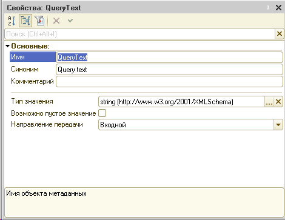

# Создание Web service через конфигуратор 1С
-----

1.	Необходимо создать Web service ```WebIntegration``` с методом ```GetQueryResult```, возвращающий текстовый аргумент и принимающим текстовый параметр ```QueryText```:
```
Функция GetQueryResult(QueryText)
    //Имя вэб-сервиса: WebIntegration
    Запрос = Новый Запрос(QueryText);
    ТаблицаРезультатов  = Запрос.Выполнить().Выгрузить();
                
    ЗаписьXML = Новый ЗаписьXML;
    ЗаписьXML.УстановитьСтроку();
    // Запись документа XML
    СериализаторXDTO.ЗаписатьXML(ЗаписьXML, ТаблицаРезультатов);
    СтрокаXml = ЗаписьXML.Закрыть();
    Возврат СтрокаXml;
КонецФункции
```
Дерево конфигурации с раскрытым узлом Web-сервисы:


Модуль:


Свойства сервиса WebIntegration:


Свойства метода GetQueryResult:


Свойства метода входящего параметра QueryText:



2. Создание роли для использования средств интеграции. Роль ```Интегратор```:

    2.1. Чтение объектов, поставить флаг:
    - константы
    - справочники
    - документы
    - журналы документов
    - планы видов характеристик
    - планы счетов
    - планы видов расчета
    - регистры сведений
    - регистры накопления
    - регистры бухгалтерии
    - регистры расчета

    2.2. ```Общие```->```Web-сервисы```->```WebIntegration```->```GetQueryResult```- использование (поставить флаг)

    2.3. ```Общие```->```Параметры сеанса```->```ТекущийПользователь```- Получение (поставить флаг)

    2.4. ```Общие```->```Параметры сеанса```->```ТекущийВнешнийПользователь```- Получение (поставить флаг)

    2.5. ```[Наименование конфигурации]```->```Права```: Внешнее соединение

3.	Создание пользователя:
    - Аутоидентификация 1С. Необходимо задать имя пользователя и пароль (опционально)
    - Роль: ```Интегратор```
4.	Публикация web-сервиса на сервере Apache (предпочтительнее), IIS и т.д.

После публикации БД и web-сервиса можно проверить доступность через wsdl-ссылку. Чаще всего ссылка имеет вид:
[```Адрес сервера```]/[```Имя базы данных```]/ws/[```Имя файла публикации```][?wsdl]
Например: **http://192.168.80.130/AccountingServer/ws/wsIntegration.1cws?wsdl**
