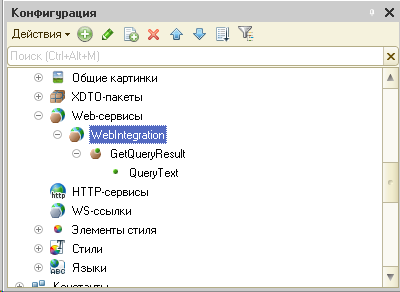
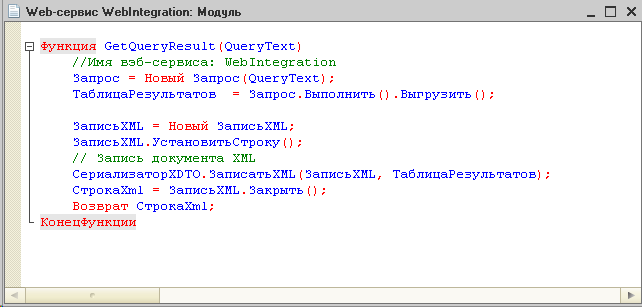
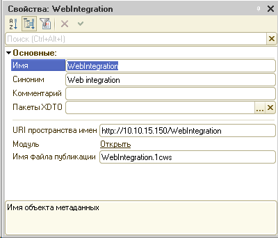
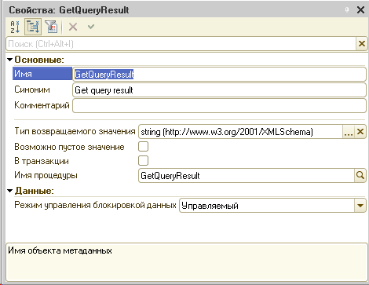
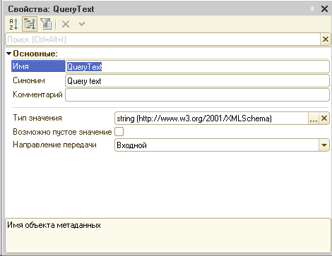

# Провайдер .NET Framework для получения данных из 1С
-----

## Содержание
<!--TOC-->
  - [Обзор](#)
  - [Установка](#)
  - [Использование](#)
    - [.NET провайдер на основе 1С ComConnector](#.net-1-comconnector)
      - [Формирование запроса и получение данных](#-)
      - [Получение структуры БД](#-)
    - [ADO.NET провайдер на основе 1С ComConnector](#ado.net-1-comconnector)
      - [Формирование запроса и получение данных](#-)
    - [Web service 1С](#web-service-1)
      - [Установка Web service через конфигуратор 1С](#-web-service-1)
      - [Использование Web service](#-web-service)
      - [Использование ADO.NET провайдера на основе Web service](#-ado.net-web-service)
  - [Проверка подключения](#-)
  - [License](#license)
<!--/TOC-->
## Обзор

**Реализовано несколько механизмов получения данных из 1С:**
1. .NET провайдер на основе 1С ComConnector с использованием технологии позднего связывания (Late binding)
2. ADO.NET провайдер на основе 1С ComConnector с использованием технологии позднего связывания (Late binding)
3. Web service 1С
4. ADO.NET провайдер на основе Web service

Реализована поддержка только примитивных типов в запросе и результате:
- boolean
- DateTime
- decimal
- string

Для непримитивных полей в запросе необходимо использовать инструкцию ```ПРЕДСТАВЛЕНИЕ(...)```. Например:
```
ВЫБРАТЬ
    Представление(СтавкиНДС.Ссылка)
ИЗ
    Перечисление.СтавкиНДС КАК СтавкиНДС
 ```

При установке ADO.NET провайдеры регистрируются в:
* ```%SYSTEMROOT%\Microsoft.NET\Framework\v4.0.30319\Config\machine.config```
* ```%SYSTEMROOT%\Microsoft.NET\Framework64\v4.0.30319\Config\machine.config```

Обращение к провайдерам возможно через фабрики ```DbProviderFactories.GetFactory(factoryName)```

## Установка
1. Загрузите последний релиз
2. Запустите ```setup.exe``` от имени ```администратора```

## Использование

### .NET провайдер на основе 1С ComConnector
#### Формирование запроса и получение данных
```csharp
public void DotNetTest()
{
    // Проектируем строку подключения к 1С
    var builder = new OneSConnectionStringBuilder
    {
        Srvr = "192.168.189.129",   // Адрес сервера
        Ref = "AccountingServer",   // Имя базы данных
        Usr = "Integration",        // Имя пользователя
        Pwd = "Integration123"      // Пароль
        //File = "...",             // Для файл-серверного варианта
    };

    // Создаем объект подключения
    using (var dbConnection = new OneSConnector())
    {
        // Подключаемся
        dbConnection.Connect(builder);

        // Создаем запрос
        using (var dbCommand = new OneSQuery(dbConnection))
        {
            // Устанавливаем текст запроса
            dbCommand.Text = @"ВЫБРАТЬ 1, ДАТАВРЕМЯ(2018, 03, 15, 1, 2, 3), ""Привет"", ИСТИНА";

            // Выполняем запрос
            using (var queryResult = dbCommand.Execute())
            {
                // Получаем результат в виде объекта DataTable
                var dataTable = queryResult.DeserializeFromValueTable();

                Assert.IsNotNull(dataTable);

                var decimalValue = (decimal)dataTable.Rows[0][0];
                var dateTimeValue = (DateTime)dataTable.Rows[0][1];
                var stringValue = (string)dataTable.Rows[0][2];
                var boolValue = (bool)dataTable.Rows[0][3];

                Assert.AreEqual(1m, decimalValue);
                Assert.AreEqual(new DateTime(2018, 03, 15, 1, 2, 3), dateTimeValue);
                Assert.AreEqual("Привет", stringValue);
                Assert.AreEqual(true, boolValue);
            }
        }
    }
}
```
#### Получение структуры БД
```csharp
public void DotNetDbStorageStructureInfo()
{
    // Проектируем строку подключения к 1С
    var builder = new OneSConnectionStringBuilder
    {
        Srvr = "192.168.189.129",   // Адрес сервера
        Ref = "AccountingServer",   // Имя базы данных
        Usr = "Integration",        // Имя пользователя
        Pwd = "Integration123"      // Пароль
        //File = "...",             // Для файл-серверного варианта
    };

    // Создаем объект подключения
    using (var connector = new OneSConnector())
    {
        // Подключаемся
        connector.Connect(builder);
        // Получаем информацию о структуре БД
        using (var valueTable = connector.GetDbStorageStructureInfo(null, true))
        {
            // Сериализуем в Xml
            var xmlString = connector.SerializeToXml(valueTable);
            // Формируем XDocument
            var document = XDocument.Parse(xmlString);

            Assert.IsNotNull(document);
        }
    }
}
```

### ADO.NET провайдер на основе 1С ComConnector
#### Формирование запроса и получение данных
```csharp
public void AdoDotNetTest()
{
    // Проектируем строку подключения к 1С
    var builder = new OneSDbConnectionStringBuilder()
    {
        ProgId = "V83.ComConnector",// Идентификатор COM-объекта
        Srvr = "192.168.189.129",   // Адрес сервера
        Ref = "AccountingServer",   // Имя базы данных
        Usr = "Integration",        // Имя пользователя
        Pwd = "Integration123"      // Пароль
    };

    // Создаем объект подключения
    using (var dbConnection = new OneSDbConnection())
    {
        // Устанавливаем строку подключения
        dbConnection.ConnectionString = builder.ConnectionString;
        // Подключаемся
        dbConnection.Open();

        // Создаем запрос
        using (var dbCommand = new OneSDbCommand())
        {
            dbCommand.Connection = dbConnection;
            // Устанавливаем текст запроса
            dbCommand.CommandText = @"ВЫБРАТЬ 1, ДАТАВРЕМЯ(2018, 03, 15, 1, 2, 3), ""Привет"", ИСТИНА";

            // Выполняем запрос
            using (var queryResult = dbCommand.ExecuteReader())
            {
                // Получаем результат в виде объекта DataTable
                var dataTable = new DataTable();
                dataTable.Load(queryResult);

                Assert.IsNotNull(dataTable);

                var decimalValue = (decimal)dataTable.Rows[0][0];
                var dateTimeValue = (DateTime)dataTable.Rows[0][1];
                var stringValue = (string)dataTable.Rows[0][2];
                var boolValue = (bool)dataTable.Rows[0][3];

                Assert.AreEqual(1m, decimalValue);
                Assert.AreEqual(new DateTime(2018, 03, 15, 1, 2, 3), dateTimeValue);
                Assert.AreEqual("Привет", stringValue);
                Assert.AreEqual(true, boolValue);
            }
        }
    }
}
```

### Web service 1С
#### Установка Web service через конфигуратор 1С
1.	Необходимо создать Web service ```WebIntegration``` с методом ```GetQueryResult```, возвращающий текстовый аргумент и принимающим текстовый параметр ```QueryText```:
```
 Функция GetQueryResult(QueryText)
    //Имя вэб-сервиса: WebIntegration
    Запрос = Новый Запрос(QueryText);
    ТаблицаРезультатов  = Запрос.Выполнить().Выгрузить();
                
    ЗаписьXML = Новый ЗаписьXML;
    ЗаписьXML.УстановитьСтроку();
    // Запись документа XML
    СериализаторXDTO.ЗаписатьXML(ЗаписьXML, ТаблицаРезультатов);
    СтрокаXml = ЗаписьXML.Закрыть();
    Возврат СтрокаXml;
КонецФункции
```
Дерево конфигурации с раскрытым узлом Web-сервисы:



Модуль:



Свойства сервиса WebIntegration:



Свойства метода GetQueryResult:



Свойства метода входящего параметра QueryText:



2. Создание роли для использования средств интеграции. Роль ```Интегратор```:

    2.1. Чтение объектов, поставить флаг:
    - константы
    - справочники
    - документы
    - журналы документов
    - планы видов характеристик
    - планы счетов
    - планы видов расчета
    - регистры сведений
    - регистры накопления
    - регистры бухгалтерии
    - регистры расчета

    2.2. ```Общие```->```Web-сервисы```->```WebIntegration```->```GetQueryResult```- использование (поставить флаг)

    2.3. ```Общие```->```Параметры сеанса```->```ТекущийПользователь```- Получение (поставить флаг)

    2.4. ```Общие```->```Параметры сеанса```->```ТекущийВнешнийПользователь```- Получение (поставить флаг)

    2.5. ```Права```: Внешнее соединение

3.	Создание пользователя:
    - Аутоидентификация 1С. Необходимо задать имя пользователя и пароль
    - Роль: ```Интегратор```
4.	Публикация web-сервисов на сервере Apache (предпочтительнее), IIS и т.д.

После публикации БД и web-сервиса можно проверить доступность через wsdl-ссылку. Чаще всего ссылка имеет вид:
[```Адрес сервера```]/[```Имя базы данных```]/ws/[```Имя файла публикации```][?wsdl]
Например: **http://192.168.80.130/AccountingServer/ws/wsIntegration.1cws?wsdl**

#### Использование Web service
Формирование запроса на получение данных:
```csharp
public void WebServiceTest()
{
    var builder = new WebServiceConnectionStringBuilder
    {
        Address = "http://192.168.189.129",                     // Адрес сервера
        UriNamespace = "http://10.10.15.150/WebIntegration",    // URI пространства имен
        Database = "AccountingServer",                          // Имя БД
        ServiceFileName = "WebIntegration.1cws",                // Имя файла публикации
        UserName = "Integration",                               // Имя пользователя
        Password = "Integration123"                             // Пароль
    };

    const string query = @"ВЫБРАТЬ 1, ДАТАВРЕМЯ(2018, 03, 15, 1, 2, 3), ""Привет"", ИСТИНА";

    var serviceRequest = new WebServiceRequest(builder, query);
    serviceRequest.QueryData();
    var dataTable = serviceRequest.ResulTable;
            
    Assert.IsNotNull(dataTable);

    var decimalValue = (decimal)dataTable.Rows[0][0];
    var dateTimeValue = (DateTime)dataTable.Rows[0][1];
    var stringValue = (string)dataTable.Rows[0][2];
    var boolValue = (bool)dataTable.Rows[0][3];

    Assert.AreEqual(1m, decimalValue);
    Assert.AreEqual(new DateTime(2018, 03, 15, 1, 2, 3), dateTimeValue);
    Assert.AreEqual("Привет", stringValue);
    Assert.AreEqual(true, boolValue);
}
```

#### Использование ADO.NET провайдера на основе Web service

Использование провайдера аналогично использованию __ADO.NET провайдера на основе ComConnector__:

- ```WebServiceConnectionStringBuilder```- для проектирования строки подключения
- ```WebServiceConnection```- для создания подключения
- ```WebServiceCommand```- для запроса данных

## Проверка подключения
Для проверки подключения можно воспользоваться утилитой ```Pike.ConnectionTest.exe```
В настройках утилиты присутствуют 2 секции параметров:
- ```SettingsConnection```- настройки провайдера ADO.NET на основе 1С ComConnector
- ```SettingsWebService```- настройки Web service и провайдера ADO.NET на основе Web service

Настройки для тестирования необходимо установить до запуска приложения.
При запуске приложения необходимо выбрать символ, который соответствует тестируемому подключению.
В случае успешного подключеия будет выведено сообщение ```CONNECTION SUCCEEDED!```

## Power Query

## License

`messageserver` is distributed under the terms of the [MIT](https://spdx.org/licenses/MIT.html) license.